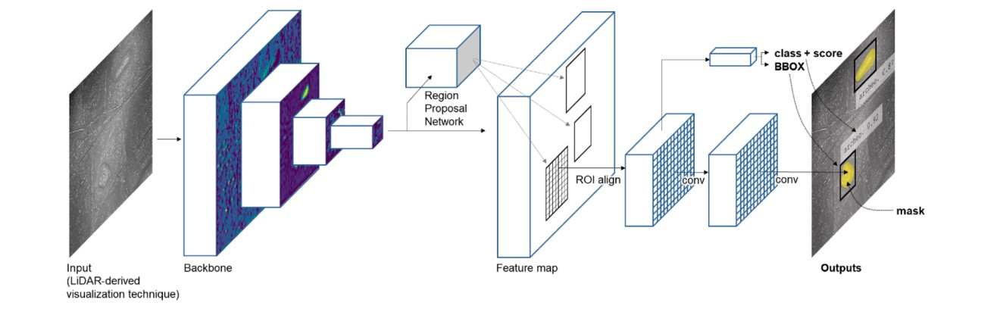

# Computer Vision in Remote Sensing

Interpreting and understanding images and videos through machines has recently become a crucial part of archaeological mapping. Computer vision has allowed certain techniques to be used to help map out potential hot spots for archaeological sites. These techniques have allowed for a structured way in which archaeological mapping analyzes and interprets remote sensing data. Some techniques that have been adapted into the archaeological field successfully include image classification, object detection, segmentation, and Convolutional Neural Networks. 
The computer vision method image classification, which was able to predict a class associated with an image leading to the use of object detection, and finally object segmentation. By being able to divide an image or data set into different regions or segments based on specific characteristics or properties it has facilitated archaeological mapping. 

Thes methods in conjunction have been able to assist in the detection and characterization of archaeological structures. (Guyot et al.) There is a structured way in which these methods are used by first classifying an image, then identifying and locating objects of interest in an image, and finally locating and delineating the object of interest. LiDAR data specifically an active remote sensing technology like Airborne laser scanning has made it easier for archeologists to achieve more accurate measurements in topography and be able to penetrate the canopy of said area. (Guyot et al.) Another method that can be used in conjunction is Convolutional Neural Networks. 

If the methods to assist in archaeological mapping are set then it would be easy to implement a deep learning algorithm to classify images, detect objects, and run segmentation tasks. But it is a lot more complex than that. Convolutional Neural Networks have been able to detect archaeological structures, but some have failed to characterize said structures. (Guyot et al.) This is mainly because of lack of ground-truth samples, meaning there is lack of data of what a structure should be characterized as just because of the amount of variation in archaeology. Even with these setbacks CNNS are a great way to predict the presence and location of different objects in an image and by providing a variety of inputs for classifying the image. (Guyot et al.) These methods of computer vision have enhanced the way archaeological mapping is done. It is interesting to see how the use of these methods will improve and grow over the next few years. This will be a great addition to the archaeological field even with limited reference data, these methods look very promising.

Guyot, Alexandre, et al. “Combined Detection and Segmentation of Archeological Structures from LIDAR Data Using a Deep Learning Approach.” Journal of Computer Applications in Archaeology, vol. 4, no. 1, 2021, p. 1., https://doi.org/10.5334/jcaa.64. 
Guyot, Alexandre, et al. “Objective Comparison of Relief Visualization Techniques with Deep CNN for Archaeology.” Journal of Archaeological Science: Reports, vol. 38, 2021, p. 103027., https://doi.org/10.1016/j.jasrep.2021.103027. 
“Object Detection in Computer Vision: A Guide - Blog.” Scale Virtual Events, https://exchange.scale.com/public/blogs/object-detection-in-computer-vision-a-guide. 
